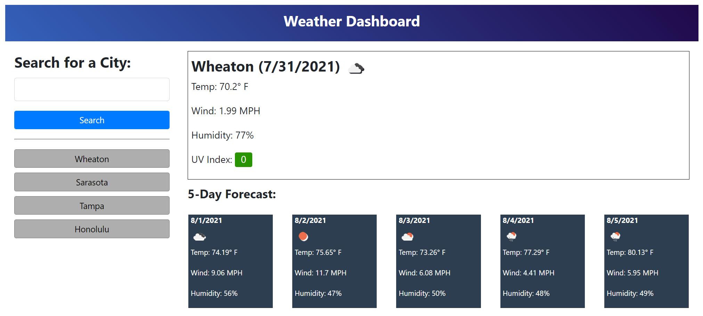

# Weather Dashboard
This sixth challenge for the Coding Bootcamp is to create an app from scratch that allows a user to see weather data for multiple cities.

[Requirements](#requirements)

[Requirement Mockup](#requirementMockup)

[What I Learned](#whatILearned)

[Weather Dashboard Screenshot](#webImage)

[Weather Dashboard URL](#projectURL)

[Contact Me](#contactMe)

---

## Requirements
<ul>
<li> Use the OpenWeather One Call API to retrieve weather data for cities.

[OpenWeather One Call API](https://openweathermap.org/api/one-call-api)
</li>
<li>When the user searches for a city, they are presented with current and future conditions for that city and that city is added to the search history.</li>
<li>The current weather conditions for that city
include the city name, the date, an icon representation of weather conditions, the temperature, the humidity, the wind speed, and the UV index.</li>
<li>The UV index is colored to indicate whether the conditions are favorable, moderate, or severe.</li>
<li>The future weather conditions for that city include 5-day forecast that displays the date, an icon representation of weather conditions, the temperature, the wind speed, and the humidity.</li>
<li>Clicking on a city in the search history presents the current and future conditions for that city.</li>
</ul>

---

## Requirement Mockup

---

## I learned...
* The difference between a client-side API and a server-side API.
* The client-server model and request-response pattern.
* How to use the fetch API
* How to parse JSON to dynamically generate HTML
* How to collect user input to dynamically generate HTML
* How to take advantage of the benefits of working with asychronous JavaScript, and how to work with the challenges.
* How to work with query string parameters.
* How to read service-side API documentation.
* How to take advantage of Chrome DevTools Network tab.
* How to use an HTTP request's response to display data to the user.
* How to handle errors that may occur when working with server-side APIs.
* How to use GitHub API endpoints.
* How to pass information from one page to another using string query parameters.
* How to make an API call dynamic by using the query
parameter to alter the request.
* How to use multiple parameters in a query string.

---

## Weather Dashboard Screenshot

---

## Weather Dashboard URL
[Weather Dashboard URL](https://bjackels5.github.io/weather-dashboard/)

---

## Contact Me
You can reach me, Brenda Jackels, at bjackels5@gmail.com.
